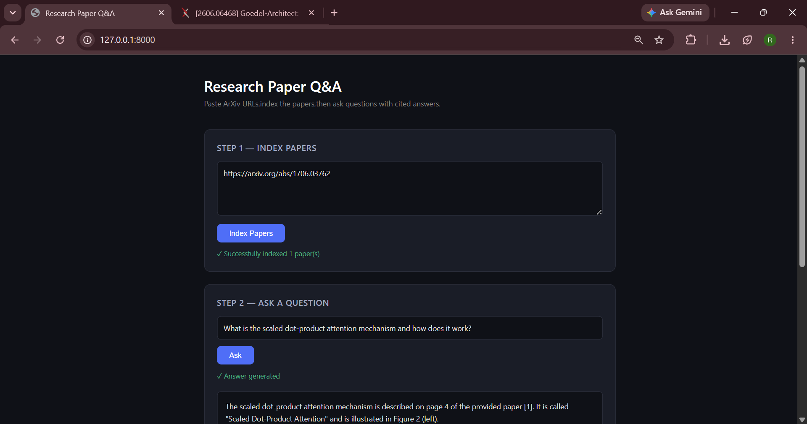
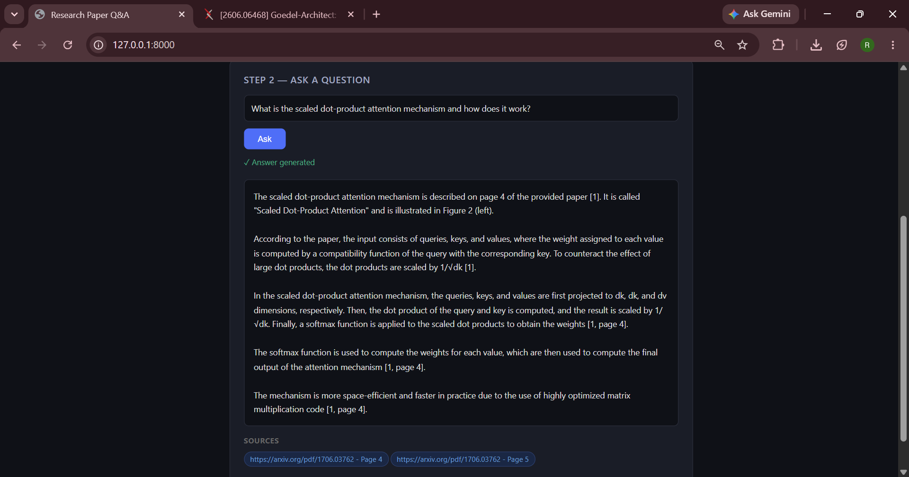

# Research Paper Q&A — RAG System with FastAPI + LLaMA3

A production-style Retrieval-Augmented Generation (RAG) system that lets you query ArXiv research papers in natural language and get cited, grounded answers — no hallucinations.

Built with FastAPI, LangChain, FAISS, and LLaMA3 (via Groq).




---

## What It Does

Paste one or more ArXiv paper URLs → the system downloads and indexes them → ask any question → get an answer with exact page citations sourced from the actual papers.

Unlike asking an LLM directly, this system only answers from the documents you provide. Every claim is grounded in a specific page.

---

## Architecture

```
ArXiv PDF URLs
      ↓
Download & Parse (PyMuPDF)
      ↓
Chunk with overlap (LangChain RecursiveCharacterTextSplitter)
      ↓
Embed locally (sentence-transformers/all-MiniLM-L6-v2)
      ↓
Store in FAISS vector index
      ↓
User Question → Embed → Retrieve top-5 chunks
      ↓
Prompt LLaMA3 (Groq API) with retrieved context
      ↓
Cited answer returned via FastAPI → rendered in browser
```

**Key design decisions:**
- **Separation of concerns** — `rag.py` handles all AI logic, `main.py` handles HTTP routing only
- **Local embeddings** — `all-MiniLM-L6-v2` runs on-device, no API cost for indexing
- **Chunk overlap** — 50-character overlap between 500-character chunks prevents context loss at boundaries
- **Grounded prompting** — LLM is instructed to answer only from retrieved context, preventing hallucination
- **Source attribution** — every answer includes paper URL and page number of retrieved chunks

---

## Tech Stack

| Component | Technology |
|---|---|
| Backend API | FastAPI + Uvicorn |
| PDF Parsing | PyMuPDF (fitz) |
| Text Chunking | LangChain RecursiveCharacterTextSplitter |
| Embeddings | sentence-transformers/all-MiniLM-L6-v2 (local) |
| Vector Store | FAISS (CPU) |
| LLM | LLaMA 3.1 8B via Groq API (free tier) |
| Frontend | Vanilla HTML/CSS/JS |
| Config | python-dotenv |

---

## Getting Started

### 1. Clone the repo
```bash
git clone https://github.com/Harru95/arxiv-rag
cd arxiv-rag
```

### 2. Create virtual environment
```bash
python -m venv venv

# Windows
venv\Scripts\activate

# Mac/Linux
source venv/bin/activate
```

### 3. Install dependencies
```bash
pip install -r requirements.txt
```

### 4. Set up environment variables
Create a `.env` file in the root directory:
```
GROQ_API_KEY=your_groq_api_key_here
```

Get a free Groq API key at [console.groq.com](https://console.groq.com)

### 5. Run the server
```bash
uvicorn main:app --reload
```

Open `http://127.0.0.1:8000` in your browser.

---

## Usage

1. Paste one or more ArXiv URLs in Step 1 (both `/abs/` and `/pdf/` links are supported)
2. Click **Index Papers** — wait 30-60 seconds for downloading and indexing
3. Type your question in Step 2
4. Click **Ask** — get a cited answer with source page tags

**Example URLs to try:**
```
https://arxiv.org/abs/1706.03762   (Attention Is All You Need)
https://arxiv.org/abs/2005.11401   (RAG original paper)
```

---

## Project Structure

```
arxiv-rag/
├── main.py          # FastAPI routes and server
├── rag.py           # RAG pipeline (download, chunk, embed, query)
├── templates/
│   └── index.html   # Frontend (HTML + CSS + JS)
├── static/          # Static assets (extendable)
├── .env             # API keys (not committed)
├── requirements.txt
└── README.md
```

---

## Limitations & Future Work

- FAISS index is in-memory — resets on server restart (persistent storage with disk save/load is straightforward to add)
- No authentication on API endpoints
- Single-user design — concurrent indexing requests would overwrite the shared index
- Deployment: Railway/Render deployment in progress

---

## Author

**Harsh Soni**  
B.Tech CSE, KIIT Bhubaneswar  
[LinkedIn](https://linkedin.com/in/harsh-soni-7819522a4) · [GitHub](https://github.com/Harru95)
